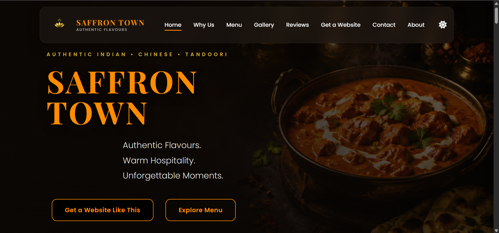
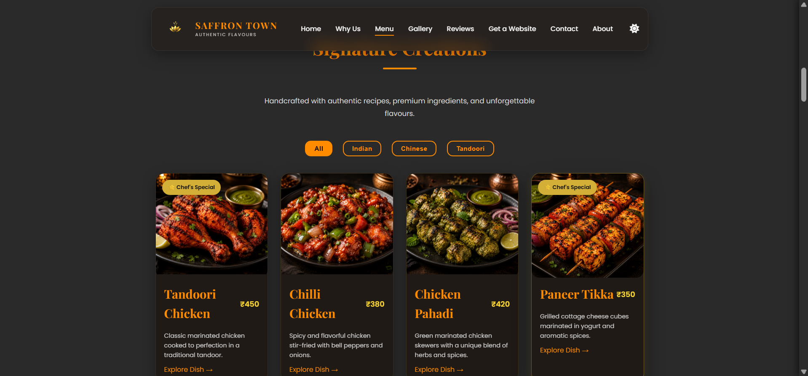
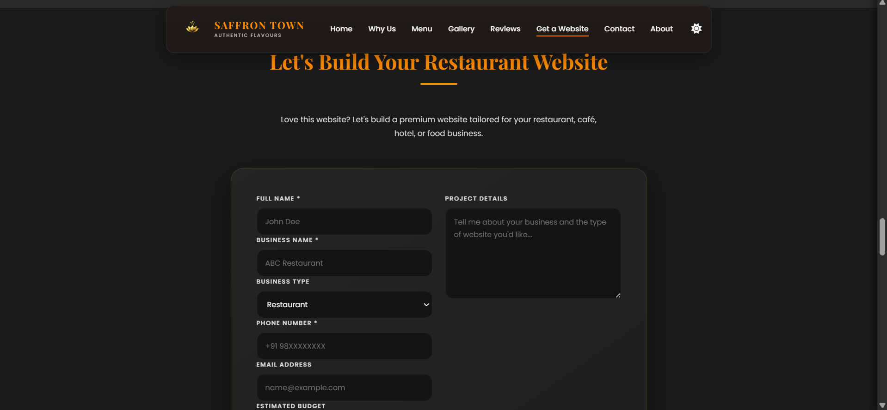
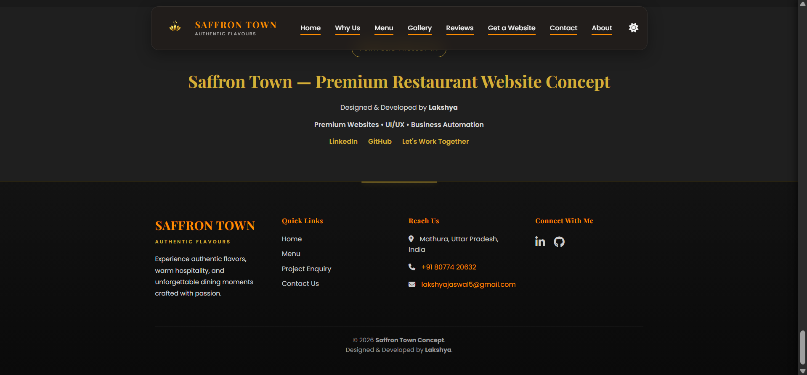

# 🍽️ Saffron Town — Premium Restaurant Website Concept

A modern, responsive restaurant website concept designed and developed as a portfolio project by **Lakshya | Digital Agency**.

## 🌐 Live Demo

https://lakshyaweb05.github.io/saffron-town-restaurant-website/

---

## 📌 About The Project

Saffron Town is a premium restaurant website concept created to showcase modern UI/UX, responsive web development, and conversion-focused design.

Although inspired by a restaurant brand, this project serves as a portfolio piece demonstrating the type of websites I build for restaurants, cafés, hotels, and food businesses.

---

## ✨ Features

- Responsive Design
- Premium UI / UX
- Mobile-First Layout
- Interactive Animations
- WhatsApp Lead Generation
- Dark Theme
- Restaurant Menu
- Gallery Section
- Testimonials
- Contact Section
- Modern Navigation

---

## 🛠️ Built With

- HTML5
- CSS3
- JavaScript
- Git
- GitHub Pages

---

## 📸 Project Preview

### 🏠 Homepage

---

### 🍽️ Signature Menu

---

### 💬 Project Enquiry

---

### 📍 Footer & Branding

---

## 🚀 Future Improvements

- Backend Integration
- Online Booking System
- Admin Dashboard
- CMS Integration
- Performance Optimization

---

## 👨‍💻 Designed & Developed By

**Lakshya**

Founder — Lakshya | Digital Agency

📧 lakshyajaswal5@gmail.com

🔗 LinkedIn:
https://www.linkedin.com/in/lakshya-jaswal-4424381a8/

💻 GitHub:
https://github.com/lakshyaWEB05
